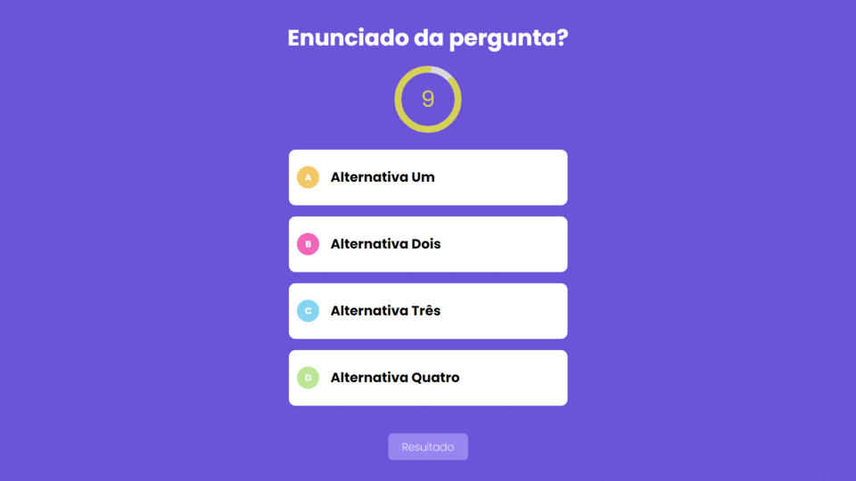

# <div align="center">Quiz Game</div>



<p align="center">The goal of this project is to develop a quiz game to demonstrate knowledge about the technologies listed below</p>

## 🛠️ Technologies

<ul>
  <li><a href="https://git-scm.com/">Git</a></li>
  <li><a href="https://reactjs.org/">React</a></li>
  <li><a href="https://nextjs.org//">Next.js</a></li>
  <li><a href="https://nextjs.org/docs/api-reference/create-next-app/">Create Next App</a></li>
  <li><a href="https://www.typescriptlang.org/">TypeScript</a></li>
  <li><a href="https://www.typescriptlang.org/docs/handbook/jsx.html">TSX</a></li>
  <li><a href="https://www.w3schools.com/css/">CSS3</a></li>
</ul>

## 💾 Installation

```
npm install
# or
yarn
```

## 🚀 Launch

First, run the development server:

```bash
npm run dev
# or
yarn dev
```

Open [http://localhost:3000](http://localhost:3000) with your browser to see the result.

You can start editing the page by modifying `pages/index.tsx`. The page auto-updates as you edit the file.

[API routes](https://nextjs.org/docs/api-routes/introduction) can be accessed on [http://localhost:3000/api/hello](http://localhost:3000/api/hello). This endpoint can be edited in `pages/api/hello.ts`.

The `pages/api` directory is mapped to `/api/*`. Files in this directory are treated as [API routes](https://nextjs.org/docs/api-routes/introduction) instead of React pages.

### Autor

Bruno Silva Santana - <ibrunoss@outlook.com> - <https://github.com/ibrunoss>
